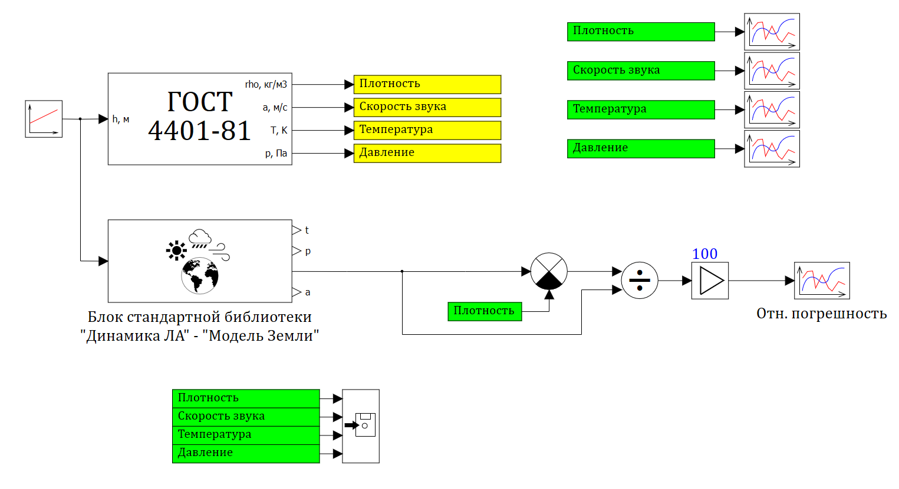

Модель стандартной атмосферы по ГОСТ 4401-81 для среды динамического
моделирования "SimInTech" для диапазона геометрической высоты от -2 до 400 км.

В отличие от стандартного блока "Параметры стандартной атмосферы (ГОСТ 4401-81)" библиотеки "Динамика ЛА" представленная здесь модель (блок) может использоваться для определения плотности воздуха, скорости звука, температуры и давления для высоты от -2  до 400 км. Стандартный блок корректно определяет параметры атмосферы до 80 км.

TODO:

- [ ] Упростить код

  
